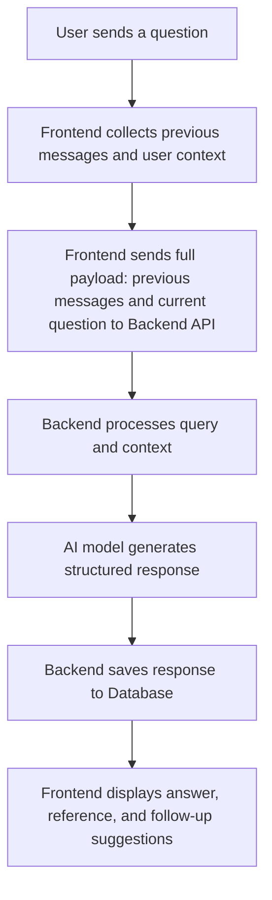

# 📚 AI Chatbot Platform

A conversational chatbot system built using **Next.js** (frontend) and **Node.js** (Express.js) (backend), integrated with a **PostgreSQL** database via **Prisma ORM**.

The platform allows users to store, retrieve, and continue previous conversations while generating detailed responses based on the conversation context and internal knowledge base.

---

## 🚀 Project Overview

- **Frontend**: Built with **Next.js** and **TypeScript**.
- **Backend**: Developed using **Express.js**.
- **Database**: **PostgreSQL**, accessed via **Prisma ORM**.
- **File Storage**: Career guidance PDFs and CSVs stored locally.
- **AI Integration**: Chatbot responses are generated by combining previous conversation, user context, and the current question to maintain flow and coherence.

---

## ✨ Key Features

- **🧠 Contextual Chatting**  
  Every new query is processed along with previous messages and database content to generate relevant, personalized answers.
  
- **📚 Structured Responses**  
  Each chatbot response includes:
  - `answer`: Main answer text.
  - `reference`: Sources or supporting documents.
  - `follow-up`: Suggested next questions.
  
- **🗂️ Historical Chats Access**  
  Users can view and continue their past conversations, just like GPT interfaces.
  
- **📄 Document-Based Knowledge Base**  
  Integrated with uploaded career guidance PDFs and CSV files, which serve as part of the chatbot's knowledge source.

---

## 🏛️ Folder Structure

### **Frontend (client/)**
```
client/
│
├── app/                        # App routing and pages
│   ├── career-guidance-home/    # Career guidance landing page
│   ├── sign-in/                 # Sign-in page
│   └── sign-up/                 # Sign-up page
│
├── components/                  # Reusable components
│   ├── chat-component/          # Chat-specific components (chat input, messages)
│   └── ui/                      # General UI components (Hero, Sidebar, Navbar)
│
├── hooks/                       # Custom React hooks
├── lib/                         # Utility functions
├── public/                      # Static assets
└── ...
```

### **Backend (server/)**
```
server/
│
├── config/                      # Database connection (Prisma)
│   └── db.js
│
├── pdfs/                        # Stored PDFs and CSVs
│
├── prisma/                      # Prisma ORM schema and migrations
│   └── schema.prisma
│
├── fileController.js            # Controllers for file-related APIs
├── fileRoute.js                 # File handling routes
├── index.js                     # Main server file
└── ...
```

---

## 🗃️ Database Schema (Prisma)

```prisma
model User {
  id        Int      @id @default(autoincrement())
  email     String   @unique
  password  String
  chats     Chat[]
}

model Chat {
  id        Int       @id @default(autoincrement())
  userId    Int
  title     String
  messages  Message[]
  createdAt DateTime  @default(now())
  updatedAt DateTime  @updatedAt

  user      User      @relation(fields: [userId], references: [id])
}

model Message {
  id        Int      @id @default(autoincrement())
  chatId    Int
  sender    String   // 'user' or 'bot'
  content   Json     // { answer: String, reference: String, followup: [String] }
  createdAt DateTime @default(now())

  chat      Chat     @relation(fields: [chatId], references: [id])
}
```

---

## ⚙️ How the Chatbot Works

### **Flow Explained:**
1. **User Query**: The user enters a new question.
2. **Context Gathering**: Previous conversation and user context are combined.
3. **API Call**: The frontend sends a request to the backend, which includes the previous conversation and the current question.
4. **Response Generation**: The backend processes the query and context. The AI model generates a structured response containing the answer, references, and possible follow-up questions.
5. **Storage**: The generated response is saved in the database for future use.
6. **Display**: The frontend receives the response and renders the answer, references, and follow-up suggestions for the user.

### **Flowchart**:


---

## 📄 PDF/CSV Data Usage

- PDFs like **Career Handbook.pdf**, **Career_Planner.pdf**, etc., are parsed and indexed.
- The chatbot can reference and cite sections of these documents in its answers for credibility and added value.

---

## 🛠️ Tech Stack

- **Frontend**: **Next.js** (TypeScript)
- **Backend**: **Node.js** (Express.js)
- **Database**: **PostgreSQL** (Prisma ORM)
- **AI Integration**: Chat model API (custom/GPT-like)
- **File Storage**: Local PDFs & CSVs

---

## 📢 Future Enhancements

- ✅ Improve knowledge retrieval using embeddings.
- ✅ Add file upload by users.
- ✅ Implement chat summarization for old conversations.
- ✅ Secure API routes and enhance auth flows.

---

## 📬 License

This project is licensed under the **MIT License**.
